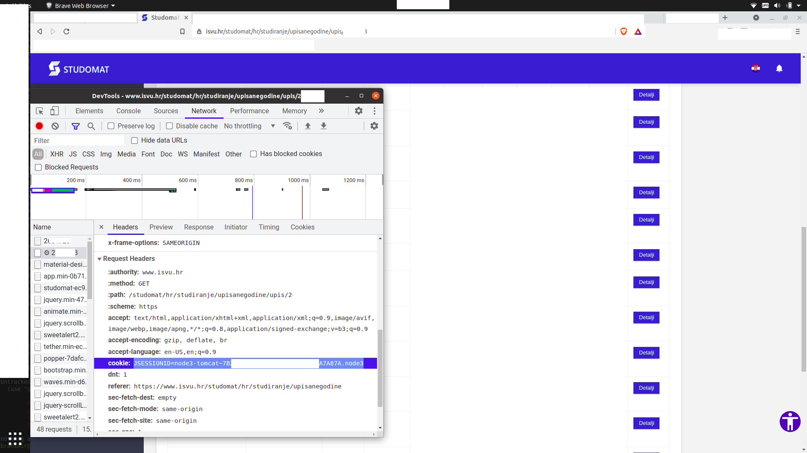

# Studomat backup alat

Mali alat koji služi za pohranjivanje podataka sa studomata.

## Zašto?
* Studomat nema funkcijonalnost backupiranja podataka.
* Podaci na studomatu postaju nedostupni nakon završetka studiranja...

## Format backupa

``` JSON
{
  "BackupData": "<datetime>",
  "Years": [
    {
      "Year": "string",
      "PrviUpis": "bool",
      "Predmeti": [
        ...
      ]
    }
  ],...
}
```

Valja pogledati tipove u datoteki [src/types.ts](src/types.ts) .

## Kako

Potreban je JSESSIONIDCookie.

JSESSIONID=node3-tomcat~XXXXXXXXXXXXXXXXXXXXXXXXXXXXXXXX.node3

Moguće ga je naći u dev toolsima proizvoljnog browsera.



## Pokretanje

```bash
git clone https://github.com/branc116/studomat-backup
cd studomat-backup
npm install
cookie="JSESSIONID=node3-tomcat~XXXXXXXXXXXXXXXXXXXXXXXXXXXXXXXX.node3" npm run start
```